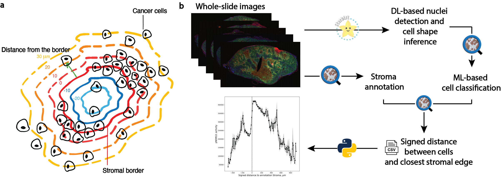

# An Image Analysis Pipeline for Quantifying the Spatial Distribution of Fluorescently-Labeled Cell Markers in Stroma-Rich Tumors



## Overview
This code repository provides the implementation of an image analysis pipeline for quantifying the spatial distribution of fluorescently-labeled cell markers in relation to the stromal border of solid tumor environments. The pipeline is designed to process high-resolution whole-slide images of fluorescently-labeled tissue sections and consists of: (1) a deep learning-based nuclei segmentation step using StarDist, (2) a machine learning-based composite classification step, and (3) a parameter sensitivity analysis and visualization step. The pipeline is implemented in QuPath (Groovy) and Python.


## Features
- Segmentation of nuclei in fluorescent images using pre-trained DL models
- Machine-learning based composite classification of cancer cells of interest
- Quantitative analysis of fluorescent markers across multiple images
- Spatial distribution using cell-stroma 2D signed distance
- Compatible with high-resolution whole-slide images 
- Visualization, sensitivity and statistical analysis of results in Python


## Software requirements
- Python 3.7 or higher (install required packages with `pip install -r requirements.txt`)
- QuPath 0.5 or higher
- StarDist extension for QuPath
- The pipeline was developed and tested on macOS Ventura 10.5. 


## Datasets
[](https://doi.org/10.5281/zenodo.13122087)

Resulting cell measurements tables are free to download at https://doi.org/10.5281/zenodo.13122087. 


## Reproducing results
To reproduce the spatial distribution plots found in the manuscript (Kozlova et al, 2024, Fig. 3), download the datasets (see above), run the notebooks cell-by-cell. Make sure to adapt the file paths to your local machine. 


## Install dependencies
To install the required Python packages in your environment, run the following commands in your terminal:

```bash
conda create -n stroma-spatial-analysis python=3.7
conda activate stroma-spatial-analysis
pip install -r requirements.txt
```

It should take only a few minutes to install all the required packages.


## Running the pipeline on your own data
To run the pipeline on your own data, follow the steps below:

1. Load your images into QuPath and create a project.
2. Run the scripts in the `qupath_scripts` folder in the following order:
    1. `stardist_cell_detection.groovy` (this step requires the StarDist extension for QuPath – the installation tutorial can be found [here](https://qupath.readthedocs.io/en/0.4/docs/deep/stardist.html))
    2. `remove_impossible_nuclei.groovy`
    3. `cell_classification.groovy` if using threshold-based classification, otherwise follow [these instructions](https://qupath.readthedocs.io/en/stable/docs/tutorials/cell_classification.html#train-a-cell-classifier-based-on-annotations) from QuPath to train a machine learning classifier .
    4. `stroma_annotation.groovy` (make sure to adapt the thresholds to your images)
    5. `measurements_export.groovy` 
    
3. Run the Jupyter notebooks cell-by-cell in the `Python` folder to analyze the exported measurement tables.


## Distribution
Our image analysis pipeline is distributed as a collection of Groovy scripts for image processing in QuPath and Python Jupyter notebooks for statistical analysis and visualization.

This repository is distributed under the MIT license. You are free to use, modify, and distribute the code as long as you provide proper attribution to the authors.